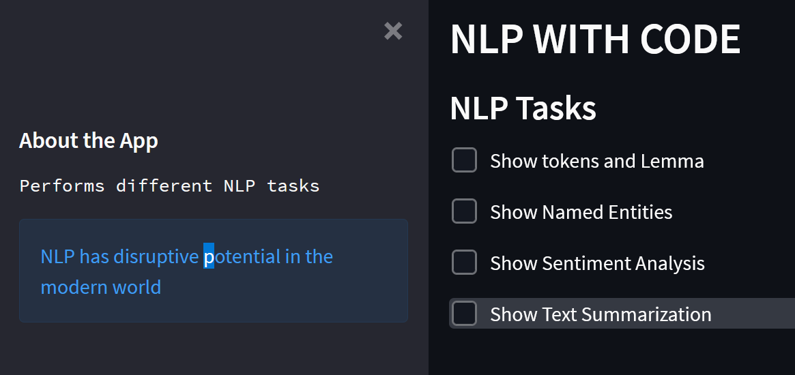
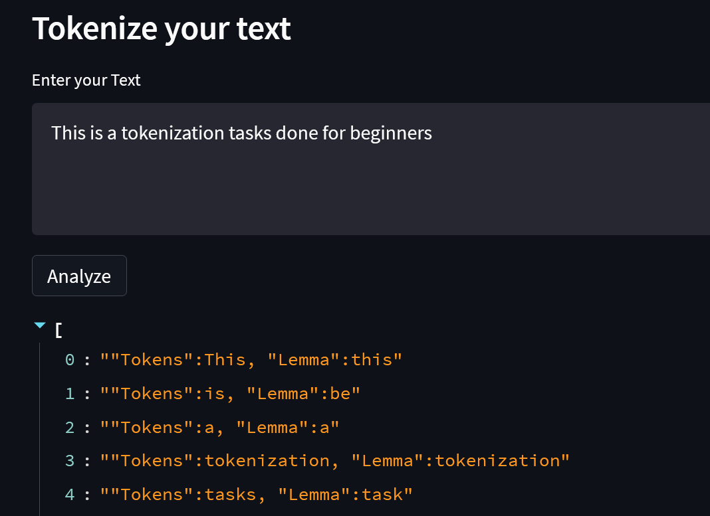

# BASIC STREAMLIT-NLP TASKS IN ONE PAGE

A basic app to test out Streamlit functionality with integration to NLP tasks

# NLP TASKS COVERED - LIBRARIES USED

- Named Entity Recognition - Spacy
- Tokenization - Spacy
- Sentiment Analysis - TextBlob
- Summarization - Transformers

# TO RUN THE APP

- Create a virtual environment with python version >=3.7
- Activate the created environment
- pip install -r requirements.txt
- Run the below command on the terminal
    streamlit run app.py

# SCREENSHOT

- 
- 
